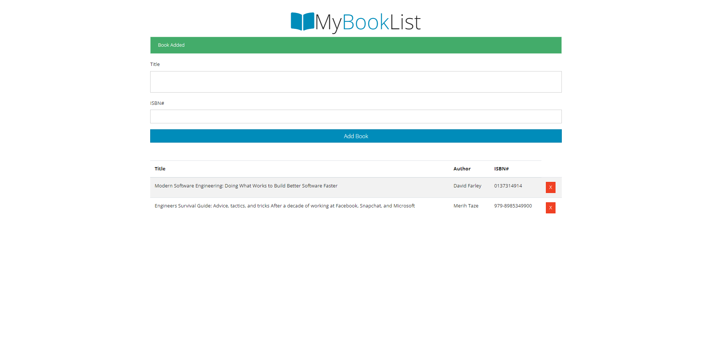

# Class based Booklist Application

Booklist Application using:

- [x] classes
- [x] local storage

## Classes

- UI Class: Handle UI Tasks
- Store Class: Handles Storage

## Storage

- Local Storage in Browser

---

<h1 align="center">

</h1>
